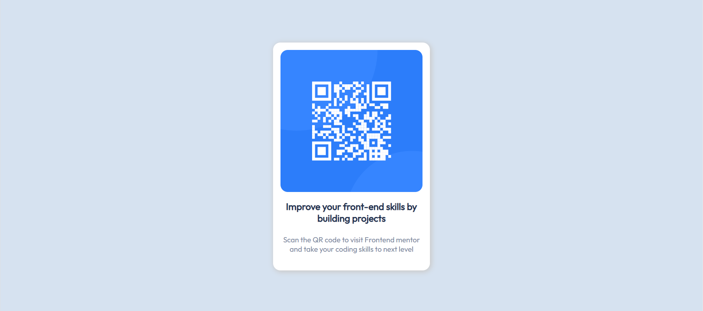

# Frontend Mentor - QR code component solution

This is a solution to the [QR code component challenge on Frontend Mentor](https://www.frontendmentor.io/challenges/qr-code-component-iux_sIO_H). Frontend Mentor challenges help you improve your coding skills by building realistic projects. 

## Table of contents

- [Overview](#overview)
  - [Screenshot](#screenshot)
  - [Links](#links)
- [My process](#my-process)
  - [Built with](#built-with)
  - [What I learned](#what-i-learned)
  - [Continued development](#continued-development)
  - [Useful resources](#useful-resources)
- [Author](#author)
- [Acknowledgments](#acknowledgments)

**Note: Delete this note and update the table of contents based on what sections you keep.**

## Overview

### Screenshot

#### Desktop

#### Mobile


### Links

- Solution URL: [Github repo](https://github.com/robicode-05/FrontEndMentor-QrCode)
- Live Site URL: [Github live demo](https://robicode-05.github.io/FrontEndMentor-QrCode/)

## My process

### Built with

- HTML5
- modern CSS

### What I learned

The use of clamp() is very interesting for fully responsive website !
```css
p { 
  font-size: clamp(1rem, 2vmin, 1.5rem);;
}
```
First time I use image background instead of using  html tag
```css
main div.qr {
  background-image: url("images/image-qr-code.png");
  background-position: center center;
  background-size: contain;
}
```

### Useful resources

- [Clamp Mdn](https://developer.mozilla.org/en-US/docs/web/css/clamp)

## Author
- Frontend Mentor - [@robicode-05](https://www.frontendmentor.io/profile/robicode-05)
