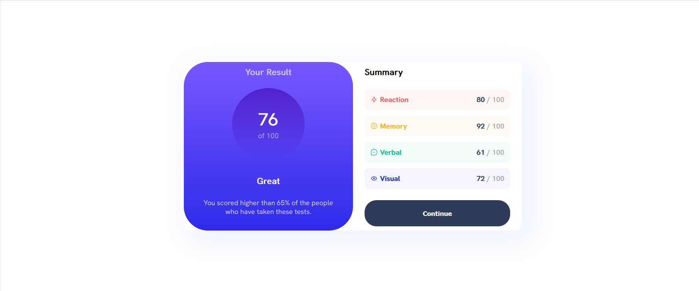
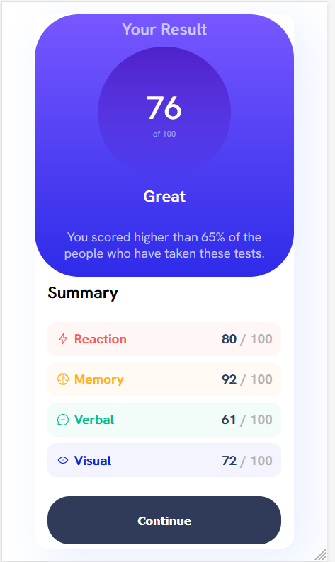

# Frontend Mentor - Results summary component solution

This is a solution to the [Results summary component challenge on Frontend Mentor](https://www.frontendmentor.io/challenges/results-summary-component-CE_K6s0maV). Frontend Mentor challenges help you improve your coding skills by building realistic projects. 

## Table of contents

- [Overview](#overview)
  - [The challenge](#the-challenge)
  - [Screenshot](#screenshot)
  - [Links](#links)
- [My process](#my-process)
  - [Built with](#built-with)
  - [Useful resources](#useful-resources)
- [Author](#author)
- [Acknowledgments](#acknowledgments)

## Overview

### Screenshot

#### Desktop

#### Mobile

### Links

- Solution URL: [Github repo](https://github.com/robicode-05/FrontEndMentor-ResultsSummary)
- Live Site URL: [Github live demo](https://robicode-05.github.io/FrontEndMentor-ResultsSummary/)

## My process

### Built with

- HTML5
- CSS3

## Author
- Frontend Mentor - [@robicode-05](https://www.frontendmentor.io/profile/robicode-05)

## Acknowledgments

Big thank to [Kevin Powell](https://www.youtube.com/@KevinPowell) for the awesome ressources on CSS
