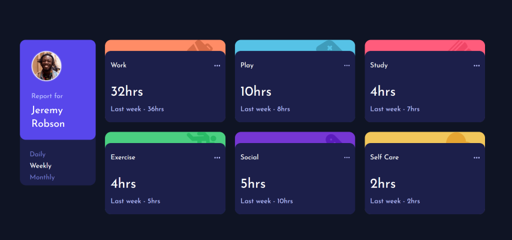
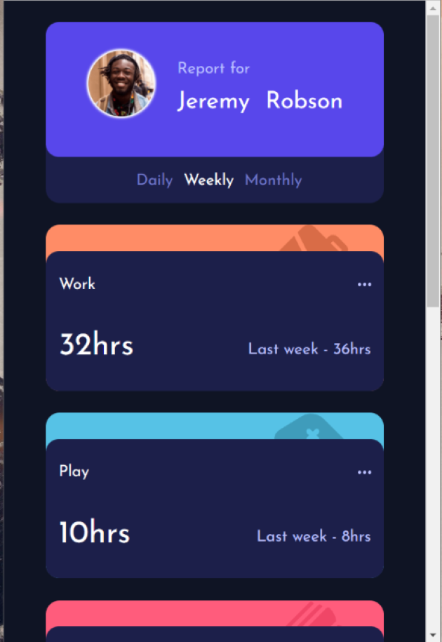

# Frontend Mentor - Time tracking dashboard solution

This is a solution to the [Time tracking dashboard challenge on Frontend Mentor](https://www.frontendmentor.io/challenges/time-tracking-dashboard-UIQ7167Jw). Frontend Mentor challenges help you improve your coding skills by building realistic projects. 

## Table of contents

- [Overview](#overview)
  - [The challenge](#the-challenge)
  - [Screenshot](#screenshot)
  - [Links](#links)
- [My process](#my-process)
  - [Built with](#built-with)
  - [What I learned](#what-i-learned)
  - [Continued development](#continued-development)
  - [Useful resources](#useful-resources)
- [Author](#author)
- [Acknowledgments](#acknowledgments)


## Overview

### The challenge

Users should be able to:

- View the optimal layout for the site depending on their device's screen size
- See hover states for all interactive elements on the page
- Switch between viewing Daily, Weekly, and Monthly stats

For this challenge I wanted to take a deep dive on the new CSS selector : `:has()` ([mdn](https://developer.mozilla.org/fr/docs/Web/CSS/:has))
The goal was to provide a functional switcher between 3 options (daily, weekly, monthly) without using any JS


### Screenshot

#### Desktop

#### Mobile


### Links

- Solution URL: [Github repo](https://github.com/robicode-05/front-end-mentor/tree/master/time-tracking-dashboard)
- Live Site URL: [Github live demo](https://robicode-05.github.io/front-end-mentor/time-tracking-dashboard/index.html)

## My process

### Built with

- Semantic HTML5 markup
- CSS custom properties
- Flexbox
- :has selector


### What I learned

After using this :has selector, i'm really exited to see what can be achieve with it when brwoser supprot will be complet

```html
<h1>Some HTML code I'm proud of</h1>
```
```css
main:has(input#daily:checked) section .duration > span:not(.daily) { display: none;}
main:has(input#weekly:checked) section .duration > span:not(.weekly) { display: none; }
main:has(input#monthly:checked) section .duration > span:not(.monthly) { display: none; }
```
```html
<fieldset>
  <input type="radio" id="daily" name="filter" value="daily">
  <label for="daily">Daily</label>
  <input type="radio" id="weekly" name="filter" value="weekly" checked>
  <label for="weekly">Weekly</label>
  <input type="radio" id="monthly" name="filter" value="monthly">
  <label for="monthly">Monthly</label>
</fieldset>

  .
  .
  .

<span class="daily current">1hr</span> 
<span class="daily previous">Last day - 2hrs</span> 
<span class="weekly current">10hrs</span> 
<span class="weekly previous">Last week - 8hrs</span> 
<span class="monthly current">23hrs</span> 
<span class="monthly previous">Last month - 29hrs</span> 
```

## Author
- Frontend Mentor - [@robicode-05](https://www.frontendmentor.io/profile/robicode-05)

